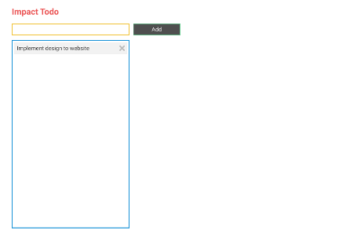
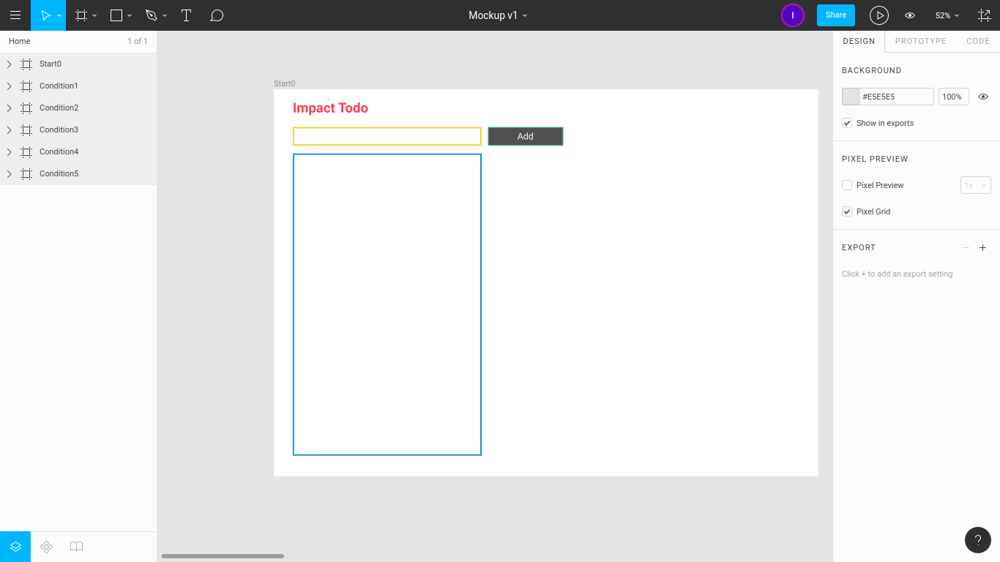
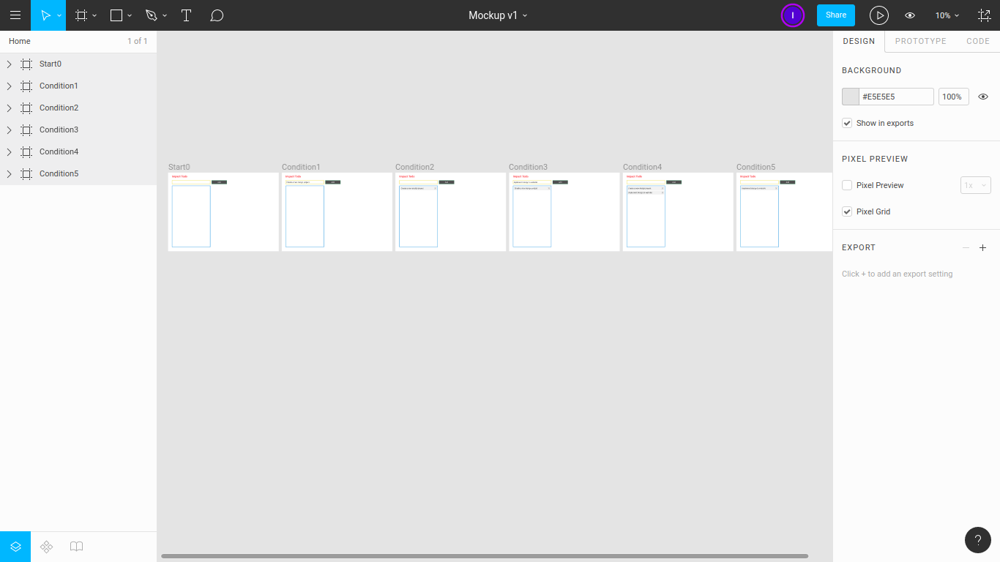
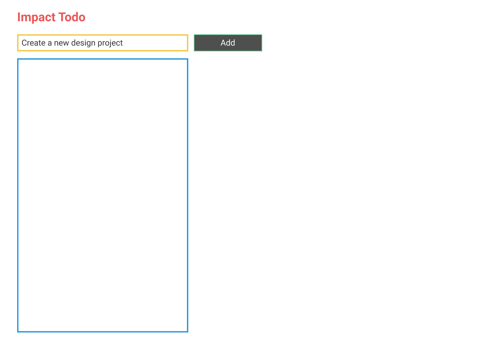
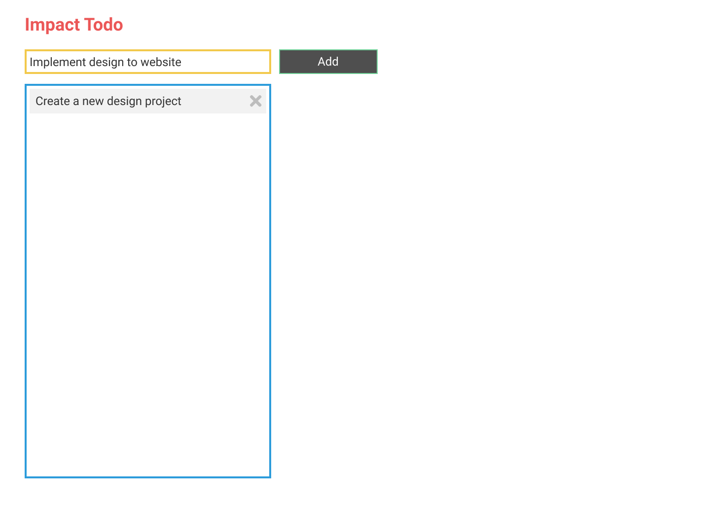
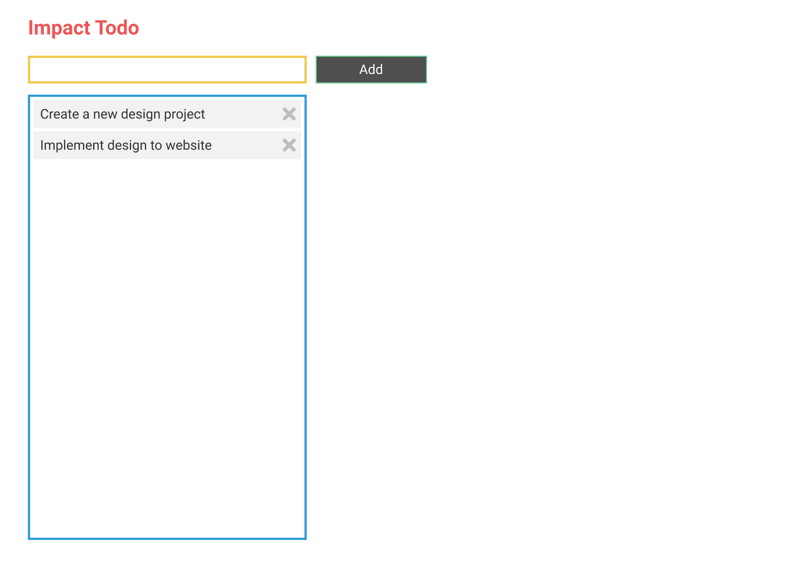

# Impact Todo

[**Impact Todo**](https://impactodo.netlify.com) is a simple todo app for everyone.

Author: [ Impact Byte](https://impactbyte.com)

---

## App

### Live on the Internet

Visit [impactodo.netlify.com](https://impactodo.netlify.com)

### Run locally

Open `index.html` file on your web browser.

---

## Application Features

### Basic Features

* Create todo
* Read one or all todos
* Delete one or all todo <button>X</button>
* Search or filter todos <button>🔍</button>
* Update todo
  * <input value="Edit text"></input>
  * [ ] Check complete todo
  * ~~Scratch~~
  * Archive

### Additional Features

* Bookmark todo
* Paginate todos
* Print todos

### Advanced Features

* Register account
* Login account
* Logout account
* Comment on todo
* Interact between users

### Master Features

* Verify email
* Forgot password
* Manage profile

### Super Features

* Sell and buy todo
* Shopping cart
* Process payment
* Analyze data

---

## Design on Figma

* Inspiration from [TodoMVC](http://todomvc.com)
* Visit [Mockup v1](https://www.figma.com/file/ID5EGTB6c4ARMn2CwfRe3AL1/Mockup-v1)
* Visit [Interactive Prototype v1](https://www.figma.com/proto/ID5EGTB6c4ARMn2CwfRe3AL1/Mockup-v1)

---

## Screenshots

**Figma Screen**

**Figma Frames**

**Start0**

**Condition1**

**Condition2**

**Condition3**

**Condition4**

**Condition5**

---

## License

See [LICENSE](./LICENSE.md)
